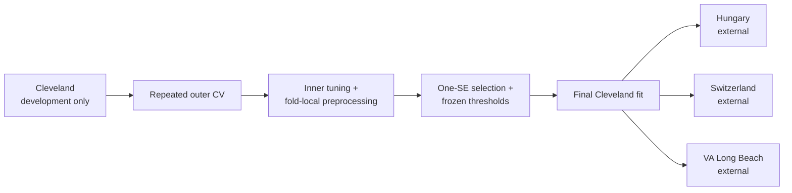

# Heart Disease Across Hospitals

[](https://github.com/Rida-khsiouine/SprintUp-Heart-Disease-Prediction/actions/workflows/ci.yml)
[](pyproject.toml)
[](LICENSE)

An independently rebuilt, AI-assisted machine-learning study of how a heart-disease classifier generalizes across hospitals. The engineering question is more interesting than a vanity accuracy score: **does a model developed only on Cleveland retain useful discrimination in Hungary, Switzerland, and VA Long Beach?**

The answer is mixed—and reported without hiding the weak cohort. Logistic regression is competitive with more complex candidates internally and degrades substantially on VA Long Beach. That is the project’s central result, not an inconvenience to remove.

> Educational portfolio project only. It is not medical advice, is not clinically validated, and must not be used for diagnosis or care decisions.

## What this demonstrates

- Leakage-safe preprocessing, tuning, and calibration inside training folds.
- Repeated nested stratified cross-validation with identical outer folds per candidate.
- One-standard-error model selection that favors a simpler model when performance is statistically indistinguishable.
- Frozen-model external validation on three untouched hospital cohorts with bootstrap uncertainty.
- Dataset provenance, immutable checksums, schema validation, safe `skops` serialization, and strict raw-record inference.
- Machine-readable evidence, an executable thin notebook, CI, and transparent AI-assisted development notes.



## Results

ROC-AUC is the primary selection metric. Brackets are patient-bootstrap 95% intervals; candidate `±` values are outer-fold standard deviations. The secondary screening threshold is selected on averaged Cleveland out-of-fold predictions and never adjusted using external labels.

<!-- GENERATED_RESULTS_START -->
_Generated from `reports/metrics.json` (smoke profile). Intervals are 95% stratified patient-bootstrap intervals._

| Evidence | ROC-AUC | Balanced accuracy | Brier score |
|---|---:|---:|---:|
| Cleveland nested CV — `dummy` | 0.500 ± 0.000 | 0.500 | 0.248 |
| Cleveland nested CV — `logistic` | 0.912 ± 0.019 | 0.835 | 0.120 |
| Cleveland nested CV — `gradient_boosting` | 0.906 ± 0.017 | 0.811 | 0.131 |
| Cleveland nested CV — `random_forest` | 0.915 ± 0.018 | 0.830 | 0.121 |
| Cleveland selected OOF — `logistic` | 0.908 [0.868, 0.942] | 0.835 [0.800, 0.887] | 0.120 [0.093, 0.145] |
| External — hungary | 0.896 [0.858, 0.931] | 0.784 [0.728, 0.830] | 0.124 [0.106, 0.148] |
| External — switzerland | 0.752 [0.630, 0.871] | 0.659 [0.575, 0.733] | 0.333 [0.305, 0.379] |
| External — va | 0.707 [0.639, 0.755] | 0.634 [0.566, 0.689] | 0.271 [0.250, 0.293] |
<!-- GENERATED_RESULTS_END -->

See [the model card](docs/model-card.md) for interpretation limits and [the generated figures](reports/figures) for ROC, precision–recall, calibration, confusion matrices, missingness, cohort shift, and feature stability.

## Reproduce it

Requirements: Python 3.11 or 3.12 and [uv](https://docs.astral.sh/uv/).

```powershell
uv sync --frozen --all-extras
uv run heart-disease validate-data
uv run heart-disease reproduce --profile smoke
uv run heart-disease predict --input tests/fixtures/patient.json
```

The smoke profile exercises the complete path with smaller resampling counts. The committed evidence is produced with:

```powershell
uv run heart-disease reproduce --profile full
```

Raw snapshots are committed because the source is small and redistribution is permitted with attribution. `heart-disease fetch-data` verifies downloads before any atomic replacement. See [data provenance and citation](data/README.md).

## Evaluation contract

- Target: `disease_present = (num > 0)`; raw severity `num` remains available for description.
- Development: Cleveland only (303 records).
- External validation: Hungary (294), Switzerland (123), and VA Long Beach (200).
- Candidates: prevalence dummy, logistic regression, random forest, and gradient boosting.
- Primary threshold: 0.5. Secondary threshold: maximum specificity subject to Cleveland out-of-fold recall ≥ 0.85.
- No imputer, encoder, scaler, calibrator, estimator, threshold, or model choice sees an outer test fold or external label during fitting.
- Small predeclared sex and broad age-band slices are labeled `underpowered` below 25 patients.

## Repository map

```text
src/heart_disease/   installable data, evaluation, reporting, artifact, and CLI code
tests/               leakage, provenance, determinism, inference, and notebook checks
data/raw/            checksum-verified UCI snapshots
artifacts/           safe model plus integrity-bound metadata
reports/             generated metrics, tables, manifests, and figures
notebooks/           one thin report consumer; no second training implementation
docs/                design, model card, before/after audit, and AI-development audit
```

The original notebook submission remains inspectable at the annotated Git tag `legacy-v1`; it is not part of this implementation.

## AI assistance and ownership

AI helped audit the legacy work, propose experiments, implement code, and draft documentation. Every accepted behavior is backed by tests, immutable data hashes, executable reproduction, or artifact round-trip checks. [The AI-assisted development report](docs/ai-assisted-development.md) records accepted and rejected suggestions and is deliberately narrower than a claim that AI “replaced a senior engineer.” The repository demonstrates effective human direction plus verifiable automation—not clinical expertise or infallibility.

New code is MIT licensed. The UCI Heart Disease data remains under CC BY 4.0; attribution details are in [data/README.md](data/README.md).
